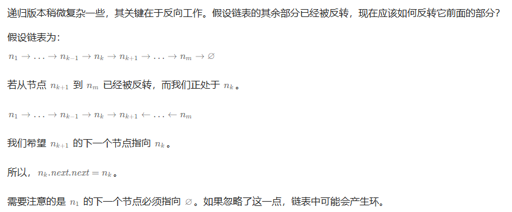

# 题目

https://leetcode.cn/problems/reverse-linked-list/description/

# 解析

**方法一 ：迭代**

假设链表为 1→2→3→∅，我们想要把它改成 ∅←1←2←3。

在遍历链表时，将当前节点的 next 指针改为指向前一个节点。由于节点没有引用其前一个节点，因此必须事先存储其前一个节点。在更改引用之前，还需要存储后一个节点。最后返回新的头引用。

**方法二 ：递归**

